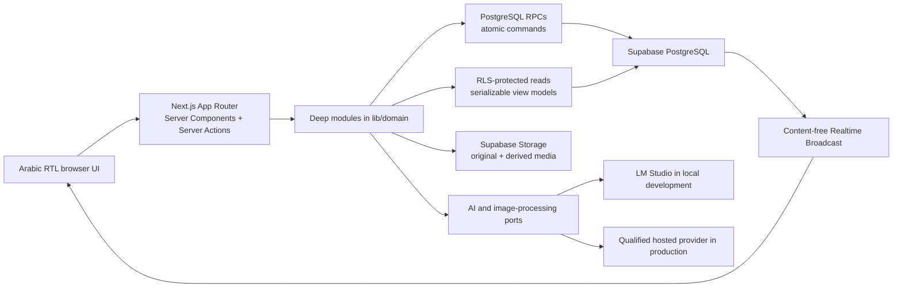

<!-- PROVENANCE HEADER — not part of the approved text. See "How to verify" below. -->

# The canonical V2 contract

This file is the **repository-relative canonical V2 architecture contract**. Where it and an
older document disagree about V2, this file wins — that is what `CLAUDE.md` §2 item 5 says a
contract is for. Where it and `PRD.md` disagree, **`PRD.md` wins and this file is stale**, and
the correct response is to raise it, not to reconcile it in code (`CLAUDE.md` §2, §8).

**Provenance.** The owner approved this text on **2026-08-15** and directed that it be
committed as the authoritative V2 contract. It arrived as a single document; everything below
the horizontal rule is that document, **byte for byte**, with nothing added, removed, or
reworded — including §15, whose absolute local path is a note about the machine the approval
was executed on, and is preserved rather than tidied.

**Approved source digest (SHA-256):**

```text
e9cd38c750b4502e02bfb41041d12249a64083df2e94f385460dea32d219e17e
```

**How to verify.** The digest covers the approved body only, so a reader can prove this header
changed nothing:

```sh
tail -n +39 docs/v2/ARCHITECTURE-V2.md | shasum -a 256
```

If that does not reproduce the digest, **the body has been edited and this header is lying.**
Amend a contract the way `CLAUDE.md` §9 says a rule is amended — in a reviewed pull request
that states what decision moved — and move the digest in the same commit.

**What this file does not do.** It does not ratify anything into `PRD.md`. Product decisions
live in `PRD.md` and nowhere else (`CLAUDE.md` §2); the V2 amendments the owner ratified
alongside this contract are in `PRD.md` §24, and this file is downstream of them.

---

# Dallal V2 — Approved Architecture and Execution Contract

**Status:** Approved execution contract, subject to the Phase 0 gates below. No V2 feature work may merge before those gates.  
**Date:** 2026-08-15  
**Repository baseline inspected:** `RayanAlDwlah/dallal`, `origin/main@b885a65`  
**Product authority for this document:** the owner's latest explicit instruction: implement every approved behavior represented across all ten files in `design-system/previews/*.html`, on top of the existing repository.

## 1. Executive decision

Build Dallal V2 **inside the current repository and current Next.js/Supabase application**.

Do not create a second repository, a second application, a second bidding engine, or microservices. The existing repository already contains the hardest and highest-risk parts of the product: authenticated identities, RLS, exact unbounded SAR money, atomic row-locked bidding, closing, anti-sniping, Realtime invalidation, and CI/database tests. Rewriting those parts would increase delivery risk and lose verified correctness.

The selected architecture is a **modular monolith with deep domain modules, migrated incrementally route by route**:

- Next.js `app/` routes and Server Actions are thin adapters.
- React components render serializable view models and contain no authorization or money rules.
- `lib/<domain>` modules expose small public interfaces and hide validation, Supabase queries, provider details, and state transitions.
- PostgreSQL RPCs own atomic, concurrent, money-sensitive, time-sensitive, and authorization-sensitive operations.
- Existing V1 journeys remain operational through an explicit expand/drain/contract transition while V2 journeys replace them in vertical slices.

### Alternatives considered

| Alternative | Outcome |
|---|---|
| Extend the current files ad hoc | Rejected. It is fast for the first screen but spreads taxonomy, session, AI, and media rules across routes and components. |
| Move everything immediately into a new top-level architecture | Rejected. It creates a large refactor before delivering user value and risks the verified V1 core. |
| New repository/application | Rejected. It duplicates auth, bidding, money, closing, deployment, and tests with no platform benefit. |
| **Deep modules + incremental replacement in this repository** | **Selected.** It preserves the proven core, creates stable seams for three parallel accounts, and lets each merged slice remain deployable. |

## 2. Phase 0 — three parallel prerequisites, not another planning exercise

`PRD.md` still says one image, no categories/search/notifications, no bid increment, and no sessions. `CLAUDE.md` ranks the PRD above the V2 decision records. Therefore feature code cannot safely begin from the current documents even though the owner has now approved V2.

Development occurs on a long-lived `integration/v2` branch created from the latest green `origin/main`. Pull requests for Phase 0 and V2 target that branch. The repository documents that merges to `main` deploy automatically to Vercel Production; therefore agents must never merge or push V2 work to `main` unattended. `R1` prepares an owner-gated staged release series from integration to `main`—expand schema, compatible application, then publish cutover—not one unsafe all-at-once merge.

The first phase contains three non-overlapping prerequisites that may run in parallel:

- `G0A authority/contracts`: record the already-made product and architecture decision.
- `F0 taxonomy evidence`: produce the canonical sourced category dataset; documentation/data work only until `G0A` merges.
- `SEC0 security baseline`: repair the known public-ID/viewer-outcome and media-ownership gaps from a clean branch, with database tests. Re-derive the fix from `origin/main`; do not copy or touch the protected untracked migration in §15.

No feature implementation starts before `G0A` is merged into `integration/v2`. No feature that reads or writes auctions, bids, profiles, or media merges before `SEC0`. Taxonomy implementation additionally waits for `F0`.

`G0A` must:

1. Update `PRD.md` so the ten approved prototypes and the decisions in this contract supersede the conflicting V1 exclusions.
2. Update `CLAUDE.md` and `ARCHITECTURE.md` only where their old invariants contradict this contract.
3. Replace the ambiguous V2 work queue with a short executable dependency graph of vertical slices.
4. Commit the module interfaces, state machines, error vocabularies, and the HTML traceability matrix from this document.
5. Define the expand/drain/contract migration and release compatibility rules in §7.
6. Publish exact issue IDs, dependencies, acceptance criteria, expected change surfaces, and the `integration/v2` base SHA for the first ready implementation wave.
7. Prove the unchanged baseline from a clean worktree. Never run database tests from the dirty local tree described in §15.

`F0` must reconcile exactly 13 main categories and exactly 110 **named** subcategories with stable slugs and source citations. The category grid visibly names 60 chips, represents another 12 only as anonymous `+N` placeholders, and the picker reveals an additional label plus wording variants; none of those views is a canonical 110-row dataset. Do not infer a “missing count” and fill it from memory. Reconcile every canonical row, duplicate/variant, parent, and source explicitly.

`SEC0` must close at least GitHub #135, #142, and #166 (or their verified current equivalents): prevent an auction from referencing another user's object; define orphan/cleanup ownership; remove internal owner/winner/bidder IDs from anonymous projections; and add a viewer-scoped outcome function that returns booleans and the permitted counterpart display name to the seller/winner without returning internal IDs. `SEC0` preserves legitimate V1 creation; revoking direct auction insert belongs to the later `P2` application cutover after `publish_auction` and the compatible create UI are live.

If `SEC0` proves that any baseline vulnerability is present in the currently deployed Production version, prepare a separate minimal security hotfix PR to `main` in addition to the integration fix. The owner must still approve its merge and any Production migration explicitly; do not hold a confirmed Production vulnerability until the full V2 release merely for batching convenience.

Each Phase 0 item is complete only after peer review, green relevant checks, and merge into `integration/v2`. These are separate PRs; `F0` is not part of `G0A`, so there is no circular dependency.

## 3. Product scope

### Included

- The complete visual system in `colors.html` and `type-and-money.html`.
- A real home and browse experience composed from `topbar`, `categories`, `auction-card`, and `session-card`.
- Search, filters, and natural-Arabic search intent shown as editable chips.
- In-app outbid notifications and notification bell.
- A four-step single-auction creation journey with 1–10 ordered images, category fields, seller-set increment, AI assistance, and the real card in review.
- One-button bidding with confirmation and all states in `bid-button.html`.
- Auction sessions: creation, ordered lots, public hall, simulated entry deposit, invite-only bidding option, host control, pause/resume, automatic progression, and session cards.
- All five AI product touchpoints in `ai.html`, implemented by the correct technology rather than forcing all five through an LLM.
- Responsive RTL behavior at 375 px, keyboard access, loading/empty/error/offline states, and real database integration.

### Explicitly excluded

- Real payment, card collection, transfer, refund, or escrow.
- Shipping, purchase contracts, general direct messaging, admin tooling, subscriptions, company-only accounts, verification badges, reserve price, maximum price, and automatic publishing by AI.
- A separate AI chat page or a sixth AI icon in the top bar.
- Public exposure of email, phone, internal identity IDs, private object paths, or AI provider secrets.

The `اسأل البائع` action is a narrow exception to “no messaging”: it creates one auction-scoped question and lets the seller post one attributable answer. It is not a private chat, exposes no contact details, and cannot carry attachments or payment/shipping coordination. The AI answer remains separately grounded only in seller-authored listing evidence; a human seller answer is visibly labeled as such and is never presented as an AI citation unless the product later adds an explicit, reviewed evidence contract.

## 4. System shape



### Module layout

Do not relocate the working repository wholesale. Deepen its existing structure:

```text
lib/
  auctions/        # publish/read/presentation; one public entry point
  bidding/         # snapshot, exact next offer, place bid, realtime convergence
  taxonomy/        # catalog and attribute validation
  media/           # upload batches, ordering, original/derived variants
  sessions/        # session aggregate and host commands
  discovery/       # browse, filters, deterministic search
  notifications/   # durable inbox and unread/read operations
  ai/              # task contracts and provider adapters
  money.ts         # existing single exact SAR implementation

components/
  auction/
  bidding/
  create/
  session/
  discovery/
  notifications/
  ai/
  ui/

app/               # route parsing, direct server reads, Server Actions, rendering
```

Each domain exposes a small public surface from its `index.ts`. Other domains must not import its internal adapters. This is a dependency boundary, not file ownership; any available contributor may implement a ready issue.

Dependency direction is explicit:

```text
money + authenticated identity
  ├── taxonomy
  ├── media
  └── bidding
        └── notifications

taxonomy + media + bidding ──> auctions/publishing
taxonomy + auction reads ────> discovery
auctions + bidding + media + taxonomy + notifications ──> sessions
taxonomy + media + discovery ──> AI assistance
```

`ai` must never depend on `bidding`, `notifications`, session outcome commands, or publish commands. Routes may compose domains but may not bypass them.

### Next.js execution rules

- Use Server Components for initial reads and compose independent reads in parallel.
- Use Server Actions for authenticated UI mutations.
- Use Route Handlers only for external/provider HTTP boundaries, streaming, or a genuinely reusable API.
- Keep Client Components limited to wizard state, drag/reorder, dialogs, countdown presentation, and Realtime subscription state.
- Pass only serializable view models across server/client boundaries.
- Use the Node.js runtime by default.
- Use `next/image` with correct `sizes` and stable aspect-ratio containers.

## 5. Domain model and database direction

All new exposed tables have explicit grants and RLS. Every money value remains `sar_amount`; every API money read is text; JavaScript never performs numeric money arithmetic.

### 5.1 Taxonomy

Add normalized tables:

- `categories`: stable unique slug, Arabic label, icon key, sort order, active flag.
- `subcategories`: category foreign key, stable unique slug within category, Arabic label, sort order, active flag.
- `category_fields`: category/subcategory scope, stable key, Arabic label, type, unit, options, constraints, searchability, sort order.

Add to auctions and session lots:

- required `category_id`.
- required `subcategory_id` belonging to the selected category.
- `attributes jsonb`, optional to the seller but server-validated: only declared keys, declared types, declared options, and declared units.

`misc` remains a deliberate main category and has a single general subcategory. Category and subcategory are stored, indexed, and usable by browse/search. Unknown keys are rejected server-side.

### 5.2 Media

Use an upload-batch model because images are selected before an auction exists and must survive form validation failures:

- `upload_batches`: owner, purpose, expiry, idempotency key, and state `open | consumed | expired | deleting`.
- `media_assets`: owner, opaque immutable object keys for private source and sanitized public variants, verified MIME/size/hash, provenance, and edit/disclosure metadata.
- `upload_items`: batch, position 0–9, media asset, selected display variant.
- `auction_images`: auction, upload item, final position; position 0 is the cover.
- `session_lot_images` and `auction_images` point to the same immutable verified media asset. Opening a lot atomically creates database link rows only; PostgreSQL never pretends to copy a Storage object in its transaction.

Rules:

- 1–10 images, JPG/PNG/WebP, at most 5 MB each, verified by bytes/signature and not filename alone.
- Upload directly to a private staging bucket through a short-lived server-issued upload intent; do not proxy up to 50 MB through a Server Action. A post-upload validator streams the stored object, checks its signature/bytes/size, quarantines invalid data, creates sanitized display variants, and only then marks the asset attachable.
- Opaque random storage keys; no public user ID in a path. The staging/source bucket is private. Only sanitized variants are publicly deliverable, either from a dedicated published bucket or an authorized signed-delivery path.
- No upsert for originals.
- Original is immutable and never deleted by enhancement or restore.
- Public/derived variants strip EXIF and other embedded metadata; the private original remains the evidentiary source.
- Derived media is separate and always carries a visible `صور معدلة` disclosure when displayed.
- Ownership is checked both in Storage RLS and when a publish command consumes a batch.
- A hosted AI/image provider never accepts a client-supplied URL or object key. The server first authorizes the asset and then sends bytes or a short-lived scoped URL.
- Publish and cleanup lock the same `upload_batches` row. Publish accepts only `open` and marks it `consumed` in its transaction. Cleanup claims only expired `open` rows with `FOR UPDATE SKIP LOCKED`, marks them `deleting`, deletes objects idempotently, then finalizes `expired`; it never touches `consumed` rows.
- The display selection is frozen at publish except for one safety operation required by the prototype: the seller may switch a displayed enhanced derivative back to its own sanitized original. This is one-way, audited, preserves both assets, keeps position/cover fixed, cannot switch to another source, and retains an image-change/disclosure event. No other post-publish replace, reorder, enhancement, or reverse switch exists.

### 5.3 Standalone auction publishing

Keep the four wizard steps as local/client state. Do not add a public database `draft` auction state.

Expose one deep command such as:

```ts
publishAuction(actor, command): Promise<Result<{ auctionId: string }, PublishAuctionError>>
```

The TypeScript command is an adapter over one `SECURITY DEFINER public.publish_auction(...)` PostgreSQL RPC. The RPC accepts no actor/owner ID; it derives `auth.uid()`, locks the upload batch, validates text limits, category/subcategory, attributes, verified batch ownership/count/order, starting price, increment, and end time, then inserts the auction, links media, consumes the batch, and records the idempotency result in one database transaction. Reuse and strengthen the existing `submission_key` uniqueness guarantee so retries return the same auction.

After this atomic path exists and compatibility rules in §7 permit cutover, revoke direct `INSERT` on `auctions` from client roles and remove the old insert policy. A Server Action that performs several independent client calls is not the publish transaction and is not acceptable.

Standalone auctions remain immutable after publication and retain the existing 5-minute-to-7-day duration range.

### 5.4 Bidding — authoritative one-button semantics

V2 deliberately changes the V1 amount rule. It does not silently change the contract of an auction that was already published; §7 defines the temporary immutable `bidding_mode` drain.

- The seller must choose an immutable positive `bid_increment` when publishing.
- It must be an exact whole SAR value and a multiple of 10; it has no maximum.
- The first accepted bid equals `starting_price` exactly.
- Every later accepted bid equals `current_price + bid_increment` exactly.
- A V2 auction has no numeric input and no public API path that accepts an arbitrary higher amount. The temporary V1 compatibility path rejects every `fixed_increment` auction and is removed after the legacy drain.
- There is still no reserve, ceiling, floating point, rounding, or leading-bidder rejection.

The authoritative auction snapshot returns `next_offer` as decimal text, computed in SQL from bid count, current price, starting price, and increment. The client displays and confirms that exact offer rather than independently deriving a money rule. It submits the confirmed amount as text. Inside the existing auction row lock, the V2 bid RPC recomputes the permitted amount and accepts only an exact match. If another bidder moved the price after the dialog opened, return `outbid_race` with the new authoritative price and require a fresh confirmation. Never silently accept a larger amount than the user confirmed.

Keep bid insertion, current-price update, anti-sniping extension, previous-leader notification, and the returned verdict in one transaction.

Recommended command contract:

```ts
placeBid(actor, {
  auctionId: string,
  confirmedOffer: SarText
}): Promise<PlaceBidOutcome>
```

The server remains the only authority. Any exact string arithmetic needed for local wizard previews or totals lives only in the single `lib/money.ts` implementation, remains width-unbounded, and is presentation only; it is never an eligibility gate and never converts an amount to JavaScript `number` or floating point.

### 5.5 Sessions and lots

Use a preparation entity rather than weakening the proven auction lifecycle:

- `sessions`: owner, title, description, cover, city, scheduled start, access mode, simulated deposit, state.
- `session_lots`: session, immutable-after-start order, full item draft, duration, start price, increment, category, attributes, open/close/result metadata.
- `session_lot_images`: ordered media before opening.
- `session_entries`: user entitlement to bid in one session; expires when the session ends.
- `session_invites`: hashed opaque token, expiry, redemption limit/state.

Queued lots are not active auction rows. When a lot opens, one idempotent session reconciliation RPC creates a real `fixed_increment` auction linked uniquely to that lot and sets its `end_time = database_clock + duration`. All bidding, extension, history, winner, and Realtime behavior then reuse the existing auction engine, but the generic standalone-auction closer must exclude session-linked auctions; the session reconciler is their sole terminal-transition authority.

Session state machine:

```text
draft -> scheduled -> live -> ended
                       |
                       +-> paused -> live
```

Lot state machine:

```text
queued -> open -> sold | unsold
queued ---------> skipped    # only after end_after_current finishes the open lot
```

Rules:

- Any authenticated user may create a session; account type is irrelevant.
- `profiles.public_kind = individual | organization` is optional/self-declared presentation metadata only. It may render `فرد` or `منشأة` under the host name, but grants no permission, verification, badge, subscription, or session capability. Existing profiles safely default to `individual` for presentation.
- Public viewing is always allowed.
- Bidding requires an unexpired session entry. `deposit = none` still creates a free entry; other values create a simulated entitlement only. The custom simulated deposit is a positive whole-SAR `sar_amount` with no product ceiling; it never creates a payment/refund ledger.
- Invite-only restricts entry/redemption, not viewing.
- Lot duration is an integer number of seconds between 300 and 3,600 inclusive. The 5/6-minute values shown in the prototype are valid presets, not a client-only rule.
- After session publication and before its database-clock `scheduled_start`, the host may add a fully validated lot and reorder existing queued lots, exactly as the prototype states. Both commands derive the host from `auth.uid()`, lock the session row, require `scheduled` and `clock_timestamp() < scheduled_start`, accept an idempotency/expected-version token, and update a gap-free unique order transactionally. At or after the start instant the server rejects them even if a stale browser still shows controls. Editing/removing an already-published lot is not implied by the prototype and is not exposed.
- Exactly one lot may be open per session, enforced by a partial unique constraint; each lot maps to at most one auction, enforced by another unique constraint.
- Every session transition uses the lock order `session -> current session_lot -> linked auction`. Cron, on-read recovery, and host actions all call the same idempotent reconciliation core; they do not implement parallel state machines.
- Standalone bidding locks only its auction and rejects a session-linked auction without then acquiring session locks. Session bidding uses a separate public RPC that locks `session -> current lot -> linked auction`, rechecks entry/access/pause/time under those locks, and executes the shared bid steps inside that same transaction. It never calls a second public bidding RPC that would reacquire locks in the opposite order.
- At scheduled time reconciliation opens the first lot. At a lot deadline it finalizes the lot and opens the next. The generic `close_ended_auctions` path ignores session-linked auctions. Correctness does not depend on a browser timer.
- The prototype's host `أغلق وافتح التالية` command may close early. Under the standard session lock order it atomically finalizes the current lot as sold to the highest accepted bid or unsold when there is none, then opens the next queued lot. It can never cancel accepted bids or choose a different outcome. It is server-rejected while paused and during the final 15 seconds of a lot with an active anti-sniping extension, exactly as the prototype states. The hall discloses that the host may close a live lot early, and every manual close is audited.
- Pause is host-only and atomic. The bid RPC, after locking the auction/session state, verifies an authorized current `session_entry`, invite/access conditions, `live`, and not `paused`; no caller-supplied session or actor identity is trusted. The standalone closer ignores session lots; the session reconciler leaves a paused lot unchanged only until its pause deadline, then performs auto-resume as specified below.
- Each lot has a database-enforced cumulative pause budget of 300 seconds. Pause records `paused_at` and remaining budget. Manual/automatic resume moves `end_time` forward by only the actual database-measured paused duration, capped by the remaining budget, leaves anti-sniping `extension_count` unchanged, and decrements that budget through a separate guarded transition flag that cannot open the bid-insert gate. Repeated pauses are allowed only while budget remains; concurrency tests prove it cannot exceed 300 seconds.
- Before `paused_at + remaining_budget`, reconciliation leaves a paused lot unchanged. At that instant it atomically auto-resumes and continues normal time; the UI displays the deadline. A missing host therefore cannot pause a lot indefinitely.
- `أنهِ الجلسة` does not cancel the current result. It atomically sets audited `end_after_current=true`; the current lot remains open, accepts valid bids, extensions, and either natural or prototype-approved manual close. Once it finalizes normally, reconciliation marks queued lots `skipped` and the session `ended`. There is no host-accessible abort/cancel path; platform/admin incident cancellation is outside scope.
- A missing host does not stop a scheduled/live session except within the finite remaining pause budget; scheduled start, auto-resume, and automatic progression remain server-side.
- `حاضر` is an approximate identity-free current-room Presence connection count. `مزايد` is the distinct count of currently connected viewers who also hold a valid unexpired `session_entry`; it is an aggregate display metric, exposes no identity, and is never an authorization source.

### 5.6 Discovery and search

URL query parameters are the canonical search/filter state. The deterministic search module supports keyword, category, subcategory, city, year-from, current-price ceiling, and ends-within filters.

- A simple word query remains ordinary text search.
- Natural Arabic input is converted to a validated `SearchIntent` and shown as editable/removable chips.
- Deterministic parsers own money, year, and time-window values.
- The model may classify Arabic category/city/intent, but it cannot create a filter value outside the schema.
- If AI is unavailable or invalid, preserve the original text as ordinary keyword search.
- Do not add embeddings or a vector database for this scope.

### 5.7 Notifications

Add a durable `notifications` table scoped by recipient RLS. Only the atomic bid/session commands may insert product notifications; client roles have no insert grant. A recipient may select and mark only their own rows. When a bid succeeds, the same transaction inserts an `outbid` notification for the previous leader when that leader differs from the new bidder.

Realtime carries a content-free invalidation event on a private authenticated recipient namespace, never the public `auction:*` room. The durable notification row is part of the bid transaction; delivery is best-effort with a short timeout/exception containment or an idempotent outbox worker. Realtime unavailability must never reject or roll back an otherwise valid bid, price/history update, or durable notification. Reconnect/foreground always re-reads the authorized inbox. The event payload is never the display source and contains no auction title, amount, profile, or internal ID.

The top bar shows unread state, a dropdown/history, mark-read behavior, and an outbid toast. Its action re-reads the latest auction offer and opens the normal confirmation dialog; a stale notification never sends a stale bid automatically.

### 5.8 AI and image processing

There are five product features but only three are language/VLM tasks:

| Feature | Implementation |
|---|---|
| Listing title/description/category from images | VLM with strict structured output; editable suggestion only. |
| Image enhancement | Separate image-editing provider/pipeline with independently gated clean-background, lighting, crop-to-product ratio, and reflection-removal operations; preserve original and disclose every derived image. |
| Natural Arabic search | Deterministic parsing plus structured model classification, yielding editable chips. |
| Item Q&A | Grounded model answer from seller-authored description and validated attributes only. |
| Starting-price suggestion | SQL analytics over comparable ended auctions; no LLM. |

AI boundaries are absolute:

- No AI module imports or calls bidding/session outcome commands.
- AI cannot bid, publish, accept/reject, extend, close, choose a winner, authenticate, or see private identity fields.
- Listing assistance may describe visible evidence but may not claim authenticity, ownership, unseen condition, maintenance, or guarantees.
- Q&A citations identify the exact supplied description sentence or attribute. Unsupported questions return `ما أعرف` and offer the narrow auction-question action defined in §3 without fabricating an answer.
- Sending images/text to a hosted provider is user-initiated, never automatic merely because step 1 opened. The client sends an authorized asset ID, never a URL/object key; the server re-checks ownership and supplies bytes or a short-lived scoped URL. Show a concise processing disclosure, minimize the payload, and prefer qualified no-training/zero-retention routing when available.
- All outputs pass a schema and category-enum validation. Invalid output is discarded.
- Rate limits, timeout, request-size caps, and cost tags apply per feature and user.
- AI failure hides/disables the assistance only; manual search, creation, and bidding continue.
- The four visible image controls from `ai.html` are four declared provider capabilities and four UI states, not one generic “enhance” button. An unsupported operation is disabled/hidden honestly and cannot be counted complete; each supported operation has before/after, pending, failure, restore, provenance, and disclosure tests.

Provider decision:

- Local development: LM Studio through an OpenAI-compatible adapter.
- Production: Vercel AI Gateway is the recommended hosted adapter because the project already deploys on Vercel and the gateway provides current model discovery, budgets, usage attribution, routing, and fallback.
- Do not hard-code a remembered model slug. Query the current model catalog, then run and commit a capability result for vision input, strict structured output, Arabic enum preservation, latency, and image editing where applicable.
- Keep production AI disabled until the capability test and a hard budget are configured. This is an external configuration gate, not a reason to fake the feature.

Price suggestion contract:

- same subcategory;
- match normalized make/model attributes when present;
- ended auctions in the previous 90 days;
- at least 5 comparable auctions;
- p25–p75 final-price range plus sample count and basis;
- seller-only, optional, and never blocks the seller's chosen starting price.

### 5.9 Public projections, viewer outcome, and seller questions

Anonymous/public reads use explicit projections or RPCs that omit `owner_id`, `winner_id`, `bidder_id`, upload ownership, and private object keys. Do not grant broad anonymous `SELECT *` on base tables merely because some columns are public.

`get_auction_viewer_outcome(auction_id)` derives the authenticated viewer from `auth.uid()` and returns only scoped presentation data: `viewer_is_seller`, `viewer_is_winner`, the sale/unsold state, final-price text, and the counterpart display name only when the viewer is the seller or winner. It never returns either party's internal UUID. The public auction/card projection returns sale state and final price without an explicit winner identity.

The narrow `اسأل البائع` feature uses `auction_questions` with asker, auction, trimmed question, status, timestamps, and one `auction_question_answers` row authored by that auction's seller. RLS permits the asker and seller to read the private request; a seller may answer once through an audited command. No attachments, contact details, arbitrary recipient, conversation continuation, or AI-authored seller answer exists. If this slice is not implemented yet, the CTA remains capability-gated and is not rendered as a working button.

## 6. Prototype decisions and resolved contradictions

The executing model must apply these resolutions and must not reopen them during implementation:

1. **Increment:** server-authoritative exact next amount. The old V1 arbitrary-amount rule is superseded.
2. **Winner presentation:** the seller and winning viewer receive the explicit winner-specific outcome; a general public card shows only the sale result and final price. This is a presentation rule, not a claim that the existing public bid history makes the winner's display name impossible to infer.
3. **Purple:** purple is a semantic accent for AI and may appear in AI panels. Multi-color gradients remain hero-only.
4. **Price AI:** the model never generates a price; SQL analytics provides an optional seller-only suggestion.
5. **Q&A evidence:** seller description plus validated seller-provided attributes, and nothing else.
6. **Money label exception:** total/current/start/final prices always use canonical `1,250.00 SAR`. The increment delta inside compact controls may use the prototype's whole-number label (`زايد بـ 500`), because increments are whole multiples of ten; confirmation always shows the resulting total canonically.
7. **End session:** `أنهِ الجلسة` means end after the current lot; the current lot retains all accepted bids and completes normally, then queued lots are skipped. The host has no cancel/abort-result path.
8. **Manual session-lot close:** only a lot inside a session has the prototype's early `أغلق وافتح التالية` control. It finalizes the highest accepted bid/unsold result atomically and is blocked in the prototype's active-extension final-15-second window. A standalone auction never has this host control: its fixed database deadline and normal anti-sniping rules remain authoritative.
9. **Post-publish original restore:** the seller may make the sanitized original visible instead of its own enhanced derivative through the one-way audited safety transition in §5.2; no other image mutation is allowed.
10. **Seller contact:** `اسأل البائع` is the narrow auction-scoped one-question/one-answer workflow in §5.9, not general messaging and not a fake button.

## 7. V1 -> V2 migration and release safety

Never assume production is empty and never invent a `bid_increment` for an already-published auction. Publication terms are immutable. The rollout is expand, dual-run, drain, then contract:

### 7.1 Read-only preflight

Before writing a migration, measure without exposing row IDs:

- active and ended auction counts;
- rows with missing/foreign/unverifiable `image_path` ownership;
- existing direct grants/policies and RPC signatures;
- current deployed app SHA and migration ledger in dev and production.

Record counts and hashes, not private identifiers. A discrepancy between repository migrations and a remote database stops the release migration, not ordinary code work.

### 7.2 Expand — backward-compatible only

1. Merge `SEC0` first on `integration/v2`.
2. Add `contract_version` and immutable `bidding_mode = legacy_open_amount | fixed_increment`. Existing rows become `contract_version=1` and `legacy_open_amount`; no guessed increment is populated.
3. Add category, subcategory, attributes, `bid_increment`, and media-link structures as nullable/conditional for legacy rows. Database checks require the complete V2 set only when `contract_version=2`.
4. Retain `image_path` temporarily. A compatibility read prefers ordered `auction_images` and otherwise returns the legacy cover. Backfill only assets whose ownership/source relationship is verified after `SEC0`; quarantine exceptions instead of silently attaching them.
5. Add the atomic `publish_auction` RPC. Every auction it creates is version 2 with `fixed_increment`, required taxonomy, and 1–10 consumed verified images. During the short dual-run window, the old direct-insert policy is structurally restricted to `contract_version=1 AND bidding_mode='legacy_open_amount'`; a crafted direct insert can never create a version-2 row outside the RPC.
6. Keep the existing arbitrary-amount RPC callable only for `legacy_open_amount` rows. Add a V2 exact-next-offer RPC callable only for `fixed_increment` rows. Both branch after the authoritative auction lock; neither can bid through the other mode.
7. Add compatibility projections so the old application remains readable/usable during the expand release.

Every expand migration is additive and can coexist with the previous application. Do not combine destructive cleanup with the release that first uses the new schema.

### 7.3 Application cutover — close legacy creation before the drain

1. Deploy the backward-compatible application that reads both versions, publishes new auctions only through `publish_auction`, and retains legacy bid UI for existing rows.
2. Verify create/read/bid health.
3. Immediately apply a separate cutover migration that revokes client `INSERT` on `auctions` and drops the old insert policy. From that point, only `publish_auction` may create auctions and it creates version 2 only. In Production this step requires explicit owner approval.
4. Database tests must prove that authenticated/anonymous crafted callers cannot create either version directly and that no new `contract_version=1` row can appear after cutover, while the RPC still idempotently creates a valid version-2 row.

Do not defer direct-insert revocation until legacy bid drain; doing so would let new legacy auctions extend the drain forever.

### 7.4 V2 application and legacy bid drain

- V2 create publishes only version-2 auctions. V2 auction pages use the one-button flow for fixed-increment auctions.
- Existing active version-1 auctions retain their original numeric-input journey until they end. This temporary compatibility UI is the only exception to “no numeric input”; it is never shown for a V2 auction and is removed after the drain. Hiding or changing a live legacy auction is worse than a short, explicit compatibility state.
- Session lots are always version 2.
- A server-side capability check/flag prevents V2 routes from exposing a mutation before the compatible schema/RPC is present.
- The drain query must prove zero active `legacy_open_amount` auctions before contract cleanup. Given the existing maximum auction duration, do not assume the drain date; measure it.

### 7.5 Contract cleanup

In a later reviewed migration: revoke/drop the legacy **bid** path; validate then enforce the V2 constraints; remove legacy UI and compatibility reads; and remove `image_path` only after every retained row has a verified media link. Direct auction insert was already removed at application cutover. This migration is irreversible enough to require the owner's explicit production approval.

### 7.6 Integration and production boundary

- `main` is the Vercel Production Branch. Agents create/merge ordinary V2 PRs only into `integration/v2`; those commits use Vercel previews and the development Supabase project.
- Peer approval authorizes merge to `integration/v2`, not production promotion.
- Feature branches test migrations only against their own isolated local Supabase/PostgreSQL stack. No unmerged branch applies a migration to the shared development project.
- `G0A` allocates non-colliding migration IDs/order for the first parallel wave. After a migration PR merges, one named rotating `DEV_APPLIER` updates from the exact `integration/v2` HEAD, re-runs the merged ledger locally, applies that merged ledger once to the development project, verifies its recorded migration/hash state without printing secrets, and posts evidence. Consumer previews remain capability-gated until this succeeds.
- The coordinator monitors `main`. After any hotfix/team merge to `main`, open a reviewed `main -> integration/v2` synchronization PR, never rebase/force the shared integration branch, resolve conflicts explicitly, and run the full affected suites before new dependent work merges.
- No agent may apply a production migration, enable paid production AI, relax production security, or merge `integration/v2` to `main` unattended.
- `R1` produces a migration/app compatibility matrix, forward/rollback runbook, exact SHAs, and staged owner-gated release PRs: (A) backward-compatible expand schema while the old app still works; (B) compatible V2 application after schema verification; (C) direct-insert cutover only after the new publish path is healthy. The later legacy-bid contract cleanup is a separate release after the measured drain. The owner explicitly approves every Production migration and main merge.
- Never merge an application commit that requires schema not already compatible with its target database. Apply expand schema first, verify, then promote the compatible app; contract cleanup is later.

## 8. HTML-to-production traceability

| Prototype | Production surfaces | Required deep dependencies | Minimum automated proof |
|---|---|---|---|
| `colors.html` | global tokens | none | token/semantic-color guard; no general gradient misuse |
| `type-and-money.html` | every route | existing money module, clock offset | exact amount, huge amount, bidi, urgent/extended countdown |
| `topbar.html` | root layout | auth, search, notifications | guest/auth nav, search, unread/read, toast action, keyboard, 375 px |
| `auction-card.html` | home, browse, search, category, ending soon, review | auction presentation/query | active, urgent, ended, unsold, viewer outcome, huge price; one shared component |
| `categories.html` | home, browse, create picker, detail specs | taxonomy and validated attributes | exactly 13/110, filter/reset, picker search, invalid attribute rejection |
| `create-auction.html` | `/auctions/new`, seller outcome | publishing, media, taxonomy, bidding terms, AI | four steps, recovery, idempotency, image order/cover, real review card, 375 px |
| `bid-button.html` | auction detail, notification CTA | atomic bidding, realtime | exact first/next bid, stale confirmation, concurrency, pending/auth/ended, extension |
| `session-card.html` | home, `/sessions` | session listing/access/presence | live/upcoming, self-declared individual/organization subtitle, deposit/access/presence/eligible-bidder states, 375 px |
| `create-session.html` | `/sessions/new`, hall, control room | session RPCs, scheduler, bidding, media, access | publish then add/reorder before start, start-race rejection/freeze, one open lot, automatic/early-manual transition, extension-window block, cumulative pause/resume, end-after-current, public-watch/private-bid |
| `ai.html` | create, search, auction detail | provider ports, media, SQL analytics | schema/grounding/privacy/outage/cost gates; four separately gated image operations, original restoration/disclosure |

There is no `home.html`. The supported home is composed from the shared top bar, category rail/grid, live/upcoming session cards, live auctions, and ending-soon auctions. Do not invent a second card or search implementation.

The static HTML is a behavior and visual reference, not production markup. It omits mobile breakpoints, viewport metadata, loading/empty/error states, the full session hall, full auction detail, and a canonical named 110-row subcategory dataset. Production must fill those gaps consistently with this contract and `F0`; it must not manufacture taxonomy labels from the headline or `+N` placeholders.

## 9. Routes

```text
/                         home composition
/auctions                 browse/search/filter
/auctions/new             single-auction wizard and type chooser
/auctions/[id]            detail, gallery, specs, Q&A, bid button/history/outcome
/sessions                 live/upcoming session listing
/sessions/new             session wizard
/sessions/[id]            public hall and entry entitlement
/sessions/[id]/control    host-only control room
/profile                  profile via avatar
```

Use query parameters for browse filters. Do not create a standalone AI route or duplicate search page.

## 10. Vertical delivery graph

```text
Phase 0 (parallel): G0A authority/contracts | F0 taxonomy evidence | SEC0 security baseline
                              |
                 G0A + SEC0 merged to integration/v2
                              |
              TEST0 browser harness + UI1 visual primitives
                              |
            T1 taxonomy | M1 media | B1 bidding (non-overlapping)
                 \           |          /
                  P1 atomic publish -> C1 create UI -> P2 cutover
                    |          |          |
             D1 discovery   N1 inbox    Q1 seller question
                    |          |
              AI/search/image/price slices
                              |
       S1 authoring -> S2 listing/hall -> S3 entry -> S4 progression -> S5 pause/end
                              |
        R1 full-story verification + owner-approved production release
```

Do not use the existing 40-row V2 board as a blind to-do list. `G0A` may retain it as historical traceability, but execution follows the small slices below.

### Executable backlog

`G0A` publishes this queue as GitHub issues with exact dependency links, acceptance criteria, expected surfaces, and base SHA. A foundation PR may expose no route, but a product slice is complete only when its real UI is integrated; a database-only foundation must not be advertised as a finished feature.

| ID | Vertical outcome | Depends on |
|---|---|---|
| `G0A` | PRD/architecture authority, contracts, traceability, exact issue graph, integration branch | — |
| `F0` | sourced canonical 13/110 taxonomy dataset and field metadata | —; data/docs only until G0A |
| `SEC0` | public projections/scoped outcome + media ownership/orphan security baseline | —; may be two focused PRs |
| `TEST0` | one Playwright harness, desktop/375 projects, local/dev Supabase two-user fixtures, CI/artifacts; never production credentials | G0A |
| `UI1` | tokens/type/money, responsive primitives, shared AuctionCard and SessionCard fixture states | G0A, TEST0 |
| `T1` | taxonomy schema/RLS/catalog + browse filter/picker/dynamic-field validation, without create-wizard integration | G0A, F0, SEC0, TEST0 |
| `M1` | private direct-upload handshake, validation/quarantine, batch/assets/order/cleanup race tests, without create-wizard integration | G0A, SEC0, TEST0 |
| `B1` | expand migration, fixed-increment snapshot/RPC, one-button panel and concurrency tests; no create-form edit | G0A, SEC0, TEST0 |
| `P1` | atomic `publish_auction`, conditional V1/V2 compatibility, dual-run policy forbids direct V2 | T1, M1, B1 |
| `C1` | complete four-step standalone wizard, AI placeholders capability-gated, real review card and recovery | UI1, P1 |
| `P2` | after compatible C1 is healthy: revoke direct auction insert/old policy and prove no new V1 row can be created | C1, P1 |
| `D1` | home auction/category/search foundation, topbar/avatar and deterministic browse; session section and notification bell stay absent until their real slices | UI1, T1, C1 |
| `N1` | durable recipient-only outbid inbox/invalidation, then activate the real bell/dropdown/toast/reconfirm in topbar | B1, D1 |
| `Q1` | auction-scoped ask-seller question/answer and unavailable-state behavior | C1, N1 security pattern |
| `AI0` | provider port, LM Studio adapter, hosted capability/budget/privacy gate | G0A, T1, M1 |
| `AI1` | image-grounded listing suggestions in creation | AI0, C1 |
| `AI2` | natural-Arabic search chips with deterministic fallback | AI0, D1 |
| `AI3` | grounded item Q&A with citations/unknown path and Q1 handoff | AI0, C1, Q1 |
| `AI4` | seller-only SQL comparable-price suggestion with range/count/basis | T1, C1 |
| `IMG1` | real provider capabilities/UI for clean background, lighting, crop, reflection removal; one-way original restore, disclosure, failure/cost controls | M1, AI0, C1 |
| `S1` | session schema/RLS/publish and ordered lot authoring, including locked/idempotent add/reorder after publish before server start | UI1, T1, M1, B1, P1, P2 |
| `S2` | session listing/card and public hall/read model/identity-free presence/eligible-bidder aggregate; integrate real live/upcoming SessionCards into `/` | S1, D1 |
| `S3` | simulated entry, invite redemption, entitlement UI/RPC | S1, SEC0 |
| `S4` | sole reconciler, separate session bid lock path, entry-aware bidding, automatic due progression, lock/uniqueness/concurrency tests | S2, S3, B1 |
| `S5` | prototype early close + extension-window guard, 300-second cumulative pause/auto-resume, end-after-current and audit | S4 |
| `R1` | both full stories, five AI proofs, security/accessibility/375 px, compatibility matrix and staged owner-gated expand -> app -> cutover release PRs | all required scope rows |

At most three rows are actively implemented at once. Before `G0A` merges, the only allowed work is `G0A`, `F0`, and `SEC0`. After `G0A` but before `SEC0`, only `TEST0`, fixture-only `UI1`, and remaining Phase 0 work may proceed. The coordinator publishes exact issue IDs/base SHAs before workers receive implementation prompts.

## 11. Three-account collaboration protocol

There is no permanent ownership. The initial Phase 0 split is only conflict reduction:

- Account A: `G0A` and creation of `integration/v2`.
- Account B: `F0` taxonomy evidence/dataset.
- Account C: `SEC0` security baseline from clean `origin/main` evidence.

After Phase 0, the coordinator assigns exact ready issue IDs. Prefer the non-overlapping first wave `T1`, `M1`, and `B1` once their listed gates are merged; use `TEST0`/`UI1` while waiting.

Any available account claims the next ready issue after its current PR merges.

Rules:

1. Read repository instructions and this contract before editing.
2. Check GitHub for an existing assignee, branch, or PR before claiming work.
3. Claim one ready issue through the GitHub assignee/`claimed` label and a comment containing account, branch, and base SHA; immediately re-read the issue and search branches/PRs before editing. If concurrent claims exist, the earliest persisted GitHub claim timestamp wins and every other account backs off to the next ready issue. This deterministic claim check happens again immediately before the first push.
4. Use one branch per issue from the latest green `integration/v2`; target that branch and never work directly on it or `main`.
5. Shared contracts and migrations merge before their consumers.
6. One open implementation PR per account unless the next issue is genuinely independent.
7. Review another account's ready PR before starting another implementation when possible.
8. After every integration merge, bring remaining branches onto the latest `integration/v2` and rerun relevant checks.
9. PR body and issue comment are the durable handoff: decision used, files, tests, screenshots, risks, next ready issue, and exact blocker if any.
10. Continue issue by issue until the model limit. Before stopping, leave a precise handoff; never leave uncommitted mystery work.
11. Peer approval permits merge to `integration/v2` only. The owner alone approves each staged release PR/migration to `main`/Production.
12. Feature branches use isolated local databases only. The rotating `DEV_APPLIER` alone applies the exact merged integration ledger to shared development and posts evidence.
13. The coordinator watches `main` and uses reviewed merge/sync PRs into `integration/v2`; never rewrite integration history.

Expected change surfaces help avoid conflicts but never block an available contributor.

## 12. Verification and definition of done

Every vertical slice must provide proportionate evidence:

- PostgreSQL contract tests for constraints, RLS, RPC errors, authorization, idempotency, and concurrency.
- Unit/module tests for pure parsing, exact money, state transitions, and AI output validation.
- Use the single `TEST0` Playwright harness for browser/component-state proof; do not let each account install a different test runner. Pure modules may keep the repository's lightweight Node/SQL style.
- Browser journeys run against local Supabase or the configured development project with isolated seeded/factory users; never use production credentials or data. They cover desktop and 375 px, Arabic RTL, keyboard focus, dialogs, error/retry, and no page-level horizontal overflow, and retain screenshots/traces on failure.
- Existing guards, negative guards, CI coverage, lint, typecheck, build, auth, auction, bidding, closing, and realtime suites remain green.
- A Realtime cue is never trusted as the display source; every client converges by an authoritative re-read.
- A forced Realtime/Broadcast failure does not roll back an accepted bid, its price/history, or its durable notification row; reconnect still restores the inbox.
- Session concurrency proof covers scheduled add/reorder racing the database start, standalone-versus-session bid lock paths, early close versus bid/extension, cumulative pause races, auto-resume, and end-after-current.
- Migration PRs prove themselves on isolated local stacks; shared development receives only the exact merged integration ledger through the recorded single-applier procedure.
- No mock/static control is exposed as a working feature. Incomplete externally configured AI is capability-gated and visibly unavailable, not faked.

The complete release requires two real end-to-end stories:

1. Browse/search -> create and publish auction -> one-button bids from two users -> outbid notification -> anti-sniping -> closing -> correct scoped outcome.
2. Create session -> arrange/publish -> add/reorder before start -> enter (simulated deposit/invite) -> public watch -> bid -> automatic or protected early host transition -> pause/auto-resume -> end-after-current or final lot -> session ends.

It also requires all five AI touchpoints with failure-mode proof and original-image restoration/disclosure.

## 13. Honest deadline cut line

With three accounts and one day, the professional target is a truthful working **preview** of the V2 core on `integration/v2`, not an unattended Production cutover:

- visual system and shared cards;
- taxonomy dataset/picker;
- four-step standalone creation with ordered images and increment;
- one-button bidding with confirmation and live updates;
- home/topbar/basic deterministic search;
- existing auth/closing/winner flows preserved.

Sessions are the strongest stretch goal. Production-qualified AI and real image editing depend on external provider configuration and capability evidence. They must not be declared complete from static screens. Production release also waits for the V1 compatibility runbook and owner approval even if the preview is ready.

If time runs out, defer in this order while keeping the interfaces and hidden controls: image enhancement, advanced AI, semantic search, notification history. Never sacrifice bid correctness, publish idempotency, image ownership, RLS, or session state safety to make a screenshot look complete.

## 14. External technical basis (verified 2026-08-15)

- Next.js App Router: Server Components for direct reads, Server Actions for UI mutations, Route Handlers for external/API boundaries: <https://nextjs.org/docs/app> and <https://nextjs.org/docs/app/guides/backend-for-frontend>
- Supabase exposed tables require RLS and deliberate grants: <https://supabase.com/docs/guides/database/postgres/row-level-security> and <https://supabase.com/docs/guides/api/securing-your-api>
- Supabase recommends Broadcast for most realtime/database-event use cases and Presence minimally: <https://supabase.com/docs/guides/realtime/getting_started>
- Supabase Storage ownership is not access control by itself; enforce RLS: <https://supabase.com/docs/guides/storage/security/ownership> and <https://supabase.com/docs/guides/storage/security/access-control>
- LM Studio supports OpenAI-compatible structured output, subject to model capability: <https://lmstudio.ai/docs/developer/openai-compat/structured-output>
- Vercel AI Gateway supports unified APIs, budgets, routing, fallback, and current model discovery: <https://vercel.com/docs/ai-gateway> and <https://vercel.com/docs/ai-gateway/models-and-providers>

## 15. Local safety warning

The local checkout at `/Users/ry7vv/Documents/Coding_Project/dllal` is on the old `feature/rayan-v2-spec` branch, behind `origin/main`, and contains protected untracked user files including:

```text
design-system/previews.zip
supabase/migrations/20260815090000_sec_internal_ids_and_viewer_outcome.sql
```

They are not part of this architecture work. `design-system/previews.zip` was explicitly identified by the owner as newly created and intentional. Do not edit, stage, delete, clean, reset, unpack, or accidentally apply either file in local database suites. Protect any other pre-existing untracked file the same way. Build and test from a new clean worktree/clone created from the latest merged `origin/main`, then branch toward `integration/v2`. Never use `git add -A` in the dirty checkout.

## 16. Approval test

This architecture is ready to execute when all of the following are true:

- the owner confirms that this document is the V2 architecture contract;
- `integration/v2` exists from a recorded green `origin/main` SHA;
- `G0A` merges the already-approved product decisions into that branch's authoritative files;
- `SEC0` closes the verified public-ID/outcome and image-ownership baseline gaps before feature work that relies on them;
- the exact sourced `F0` 13/110 dataset is present before taxonomy code merges or the product claims that count;
- a clean baseline is green;
- `TEST0` provides one browser harness before route integration is declared complete;
- each account receives the same continuous worker protocol and a different exact ready issue/base SHA;
- all automated merges target `integration/v2`; only the owner can approve the staged `main`/Production release series.
